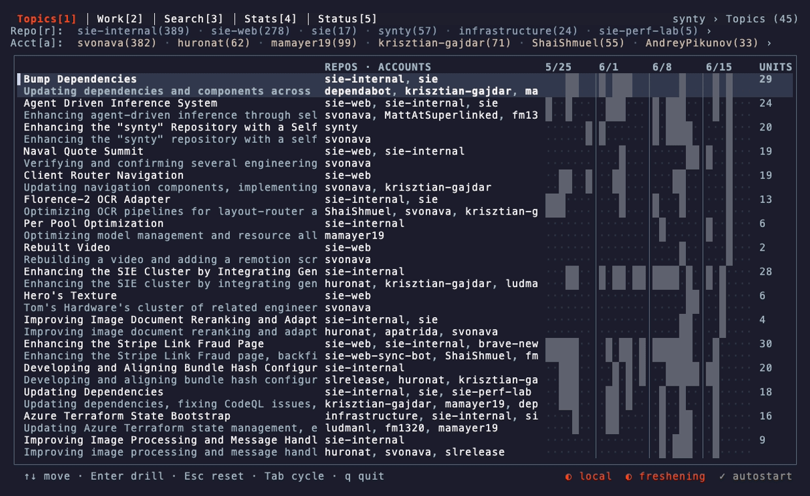

# synty

**Your coding agents start every session from zero. So do you.**

synty passively records every coding-agent session (Claude Code, Codex, Cowork)
and your GitHub activity into one local, searchable memory, for you and the
agents you work with.



<sub>Demos rendered from [`docs/*.tape`](CONTRIBUTING.md#rendering-the-demo-gifs) with [vhs](https://github.com/charmbracelet/vhs).</sub>

- **Recall, not re-discovery.** Ask *"has anyone touched the auth flow?"*, or just
  run `synty related`, and get the sessions and PRs that matter. You browse in
  the TUI; your agents read the same over the CLI and MCP.
- **Your data stays yours.** Everything is open on disk: raw events as JSONL, a
  SQLite index, `--json` on every command. Chart agent friction, fine-tune a
  model, build your own dashboards. Nothing is trapped in a viewer.
- **Local-first.** One binary and no remote model API: even the one-line
  summaries run locally. Data stays on the machine unless you explicitly join
  a shared team bucket.

## Quick start

```sh
curl -fsSL https://raw.githubusercontent.com/superlinked/synty/main/install.sh | sh
```

One paste installs the binary, turns on the login-time tracker, and opens the
viewer. After that, two commands cover the daily loop:

```sh
synty tui        # browse your work memory: topics, sessions, search, stats
synty related    # surface prior work for whatever you're doing now (no query)
```

The tracker runs at login, so the memory keeps building on its own. Update any
time with `synty upgrade`. Building from source instead? See [Build](#build).

## Commands

Every read command prints Markdown to stdout, or `--json` for a versioned envelope.

| Command | What it does |
|---|---|
| `synty related` | prior work for your current task, from this repo's git (no query) |
| `synty search "<query>"` | semantic search; add `--filter repo=…,kind=pull_request` |
| `synty recent` | latest PRs, issues, and prompts |
| `synty topic [name]` | emergent topics, or one topic's members |
| `synty show <id>` | open a session, PR/issue (`repo#123`), or topic |
| `synty trace list/show/search/compare` | inspect turns, paired tool calls, async jobs, and bounded event evidence |
| `synty status` | what's indexed, freshness, activation, the fleet roster |
| `synty stats` | tokens / tools / sessions vs LOC / PRs / issues per week |
| `synty tui` | interactive browser: tabs, drill-down, filter by repo or account |
| `synty mcp` | serve the read surface to agents (stdio, or `--http` with token) |
| `synty import` | ingest harness/Devin NDJSON into a local owned stream |
| `synty build` / `synty up` | rebuild the index once / keep it fresh on a loop |

A result is a ranked Markdown card with ids you can drill (`[a1b2c3d4]` sessions,
`repo#123` PRs/issues, `[72a778f8]` topics) that feed `synty show`:

```text
## rate limiting middleware

1. [24.3] **pull_request api#1487** — Add a token-bucket limiter to the gateway
   merged · https://github.com/acme/api/pull/1487
2. [21.8] _user_prompt · api · a3f1c2d9_
   how do we share the per-tenant limiter's state across pods? settled on Redis…
3. [19.0] **issue api#1502** — 429s under burst load on the search endpoint
   open · https://github.com/acme/api/issues/1502
```


## Own your data

synty is a capture layer, not a walled garden. Everything it records sits in
plain files under `~/.synty`, so you can build on it directly:

- **Raw events** (the source of truth): append-only JSONL under `corpus/local/`
  (and `events/<stream>/` in a shared bucket).
- **Documents**: `corpus/docs.jsonl`, one object per line with `meta`
  (`source`, `kind`, `repo`, `author`, `session_id`, `campaign_id`,
  `campaign_role`, `backend`, `capture_source`, `ts`).
- **Metadata**: a SQLite database under `index/`, queryable with any SQLite tool.

```sh
synty stats --json | jq '.data.weeks[] | {week: .start, tok_in, tok_out}'   # weekly token trend
synty trace list --type spans --status error --sort duration               # slow/error tool evidence
synty trace list --type jobs --sort wait                                   # associated exec/poll lifecycles
synty trace search 'libxcb.so.1'                                           # literal bounded-evidence lookup
synty trace show <full-or-unique-id> --json                                # surrounding execution context
# Agents can call the same forensic surface over MCP (synty_trace_*), including
# authenticated HTTP when the binary is built with --features mcp-http.
jq -r '.meta.kind' ~/.synty/corpus/docs.jsonl | sort | uniq -c              # straight from the raw file
```

Because synty already clusters the work and links across sources (PRs, issues,
sessions), your analysis starts from structured data, not a heap of logs.

Harnesses can import their own canonical NDJSON and use the same read surface:

```sh
# Validate first; rejected rows can be quarantined without changing the corpus.
synty import run.ndjson --format harness --machine eval-1 --campaign c42 \
  --role validator --repo sie-internal --since now --redaction standard \
  --quarantine tmp/rejected.ndjson --dry-run

# A writer may then append and publish the owned harness stream.
synty import run.ndjson --format harness --machine eval-1 --campaign c42 \
  --role validator --repo sie-internal --bucket s3://my-team-synty

# Local agents normally use stdio. Remote server-side agents use authenticated
# Streamable HTTP; a non-loopback bind additionally requires HTTPS material.
synty mcp --role investigator --scope scope.json --redaction mcp_safe
SYNTY_MCP_TOKEN="$token" synty mcp --http --bind 0.0.0.0:8765 \
  --listen-public --tls-cert tls.crt --tls-key tls.key \
  --allowed-origin https://memory.example.com --scope scope.json
```

`import` also accepts `--actor`; omit `--dry-run` to append. `mcp --http`
defaults to loopback, where TLS is optional for local development. The scope
file contains `repos`, `campaigns`, `roles`, and native `sources` allowlists.

## Teams

Solo, the "bucket" is a local directory. For a team, or just your own laptop and
desktop, point synty at one shared S3/GCS bucket and you build one memory:

```sh
# Workstation: a durable credential_process profile (for example Roles Anywhere)
synty init s3://my-team-synty --aws-profile synty-writer --capture-since now

# AWS VM/container: omit --aws-profile and use its instance/task/workload role
synty init s3://my-team-synty --capture-since 2026-07-21

# Container / supervisor: skip launchd/systemd; run track --watch yourself
synty init s3://my-team-synty --capture-since now --no-build --no-autostart

# Upload only named repositories. Repeat --capture-repo as needed.
synty init s3://my-team-synty --capture-repo api --capture-repo web

# Raw events remain the rebuildable bucket source of truth by default.
# Redaction before upload is explicit and irreversible for those chunks.
synty init s3://my-team-synty --upload-redaction standard

# Stamp campaign metadata, choose the stream identity, and set the default
# response redaction used by a separately supervised MCP process.
synty init s3://my-team-synty --campaign c42 --role primary --machine eval-1 \
  --mcp-redaction mcp_safe --no-autostart
```

Codex and Claude Code session roots honor `$CODEX_HOME` and `$CLAUDE_CONFIG_DIR`
when set (otherwise `~/.codex` / `~/.claude`). MCP responses default to the
`mcp_safe` redaction profile. Upload redaction defaults to `off`, preserving raw
events as the rebuildable source of truth; opt in with `init
--upload-redaction standard`. A repository allowlist is enforced before upload
and during import. Unknown sessions fail closed. Changing upload redaction or
the repository allowlist after offsets advance requires a new bucket prefix or
an intentional ledger reset, because already-uploaded chunks are immutable and
filtered history cannot be backfilled from an advanced cursor.

On a systemd-based EC2 developer VM, enable lingering once so the per-user
tracker starts at boot without an SSH login, then run `init` normally:

```sh
sudo loginctl enable-linger "$USER"
```

That bucket is the only shared infrastructure: no build server, no coordination
service. Each machine writes a stable `edge-<machine>-<source>` stream, so
writers do not overwrite one another. Local readers and builders pull every
stream plus the latest published read-model. MCP-only readers pull just that
read-model, which includes compact session, tool, fleet, and trace projections.
A bounded stream registry and per-stream local key cursors avoid relisting
historical chunks on each local read. The TUI builds unpublished event deltas in the background;
`synty build` does the same explicitly, while `search` warns if raw events are
newer than the published index. One tokened machine scrapes GitHub for everyone.

The tracker polls locally every 30 seconds and, by default, uploads only new
complete event lines every 60 seconds as immutable chunks (not one request per
event and not a whole-file rewrite). Set `--upload-interval <seconds>` on
`init` to change that cadence. `--capture-since now`, a UTC date, or an RFC3339
timestamp is resolved and persisted as an absolute lower bound; older agent
content is neither newly uploaded nor included in a published read-model. This
is a forward collection boundary, not deletion of objects already in a bucket.

Do not use an expiring `aws sso login` session as the unattended credential.
On workstations, point `--aws-profile` at a shared-config profile backed by a
refreshing `credential_process`; on EC2/ECS/EKS, omit it and grant the workload
role access to the bucket. The login service stores only the profile name, never
AWS keys. Release assets include S3/GCS support; source builds need
`--features s3` / `gcs`.

For S3, scope each writer/reader role to the chosen bucket (or URI prefix):
`s3:ListBucket` on the bucket and `s3:GetObject`, `s3:PutObject`, and
`s3:DeleteObject` on its objects. Delete is used only to release the soft build
lease; event chunks and content-addressed derived objects are immutable.
An MCP-only workload needs no writes: `deploy/aws/mcp-reader.yaml` creates an
IRSA role with only bucket location/list and object get permissions. Use it
with the tracker and builder disabled. If EKS and S3 are in different regions,
set Helm's `bucketRegion` to the bucket's region so requests are signed for the
correct endpoint.

> **Heads up:** every member with raw bucket credentials can read every stored
> object. Mediated MCP clients are narrower: role/tool policy, optional read
> scope, and response redaction. If neither fit, stay local, or scope the bucket
> to people who already see each other's work.

For HTTP MCP, use a random token of at least 32 bytes. A non-loopback listener
requires `--tls-cert` and `--tls-key`; the Helm chart mounts them from a
Kubernetes TLS Secret. Browser callers also need an exact `--allowed-origin`;
server-side callers normally send no Origin header. A scope's `sources` values
name native producers such as `harness`, `codex_cli`, or `github`. Restricted
scopes omit fleet-wide status/stat/tool surfaces and rebuild topic facets only
from allowed members. HTTP `synty_related` accepts client-supplied `context`
and never reads a caller-provided path on the server.
MCP pulls the complete published read-model before serving and refreshes it on
a background thread; it never mirrors the raw event lake. Format-2 builds carry
compact session/tool/fleet facts plus a trace projection whose searchable
evidence, commands, and outputs are capped per event. `/health` reports
transport liveness and `/ready` waits for both projections. Analysis tools are
serialized on a one-slot dispatcher so concurrent first loads cannot multiply
memory. HTTP work is bounded by separate semantic and analysis queues, a
120-second response deadline, 32 in-flight requests, 64 live connections,
10-second TLS/header/body read deadlines, and a per-client 120-request/minute
window; queued work whose client timed out is dropped before execution.
A bucket still on read-model format 1 needs one `synty build` from a
write-enabled builder before remote MCP becomes ready. The MCP service account
does not perform that migration or write anything back.

The Helm chart under `deploy/helm/synty` defaults to the private image
`851725219920.dkr.ecr.eu-central-1.amazonaws.com/synty:<appVersion>`. Version
tags build each architecture on a native GitHub runner, then publish a verified
`linux/amd64` + `linux/arm64` manifest through GitHub OIDC. Deploy
`deploy/aws/ecr-publisher.yaml` once and set the repository variable
`AWS_ECR_PUBLISH_ROLE_ARN` to its role output. Remote MCP is disabled by default;
enabling it requires a TLS Secret and a NetworkPolicy whose source selectors
name trusted callers. The policy also requires explicit object-store CIDRs;
cluster DNS and only those destinations on TCP 443 are allowed for egress.
CIDR configuration is capped at 64 ranges and rejects IPv4 prefixes broader
than `/12` or IPv6 prefixes broader than `/32`, including split-default-route
combinations. The Service remains cluster-internal, and its default ingress
accepts only same-namespace pods labeled
`synty.superlinked.com/mcp-client: "true"`.

## How it works

- **Retrieval is late interaction.** `pylate-rs` runs a small ColBERT model
  (ModernBERT, 32 M params) that encodes each document as one vector per token;
  `next-plaid` scores queries with MaxSim over a SQLite metadata filter. That
  per-token scoring lets a rare or specific term (a function name, a file path)
  carry its own signal, instead of being averaged into one document vector the
  way single-vector embeddings do.
- **Summaries and topic names** come from a small local model (Qwen3-0.6B) on
  your CPU, never a remote API, with an extractive fallback.
- **Events are the source of truth.** The index and metadata are derived
  projections, rebuildable any time and shareable through a bucket.

Architecture and rationale live in [`docs/design.md`](docs/design.md); the
on-real-data validation lives in [`evals/`](evals/).

## Build

```sh
cargo build --release                          # plain CPU, portable (the shipped core)
cargo build --release --features s3,gcs,mcp-http   # team + remote MCP container build
```

On Apple Silicon, add `--features metal` for GPU encode (~5.7× faster);
`accelerate` (macOS) and `mkl` (Linux) are CPU-BLAS alternatives. Release assets
and the Dockerfile include `mcp-http`. The embedding model (~127 MB) downloads
on first use; the summarizer (~1.2 GB) the first time anything summarizes. For
an air-gapped setup and the per-stage pipeline, see
[`docs/design.md`](docs/design.md) and [CONTRIBUTING](CONTRIBUTING.md).

Cutting a release is a maintainer task: see [CONTRIBUTING](CONTRIBUTING.md#releasing).
